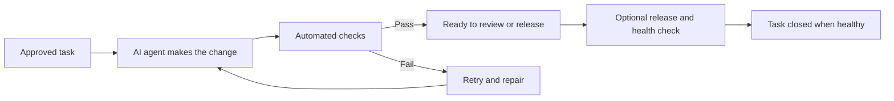

# ai-dispatcher

Describe a problem or feature in plain language, walk away, and come back to a working,
verified update in your production app. ai-dispatcher uses the AI coding tools you already
have — ChatGPT with Codex, Claude with Claude Code, or both — and keeps the work moving
through testing, fixes, and release until the result is healthy.

[](https://github.com/BourbonBaggers/ai-dispatcher/actions/workflows/ci.yml)
[](https://www.npmjs.com/package/@bourbonbaggers/ai-dispatcher)
[](LICENSE)
[](https://nodejs.org/)

## For non-technical readers

### Who is this for?

ai-dispatcher is for people who are discovering “vibe coding”: you can describe what you
want to build, but you do not want to babysit an unfinished change or learn the mechanics
of testing and deployment before your idea becomes real. It is also for small teams that
want the same dependable path from a request to a working production result.

### What problem does it solve?

Good ideas and important fixes often get stuck between “someone should handle this” and
“it is working in production.” Work waits in a queue, developers lose time to repetitive
follow-up, automated checks fail without a clear owner, and a task can appear finished
before anyone has verified the result.

### Issue creation flow: where the work begins

The quality of the queue is established before ai-dispatcher ever sees it:

1. A person starts a GitHub-connected AI chat session and describes the outcome they want.
2. The chat inspects the repository and asks focused questions about current behavior,
   scope, edge cases, and tradeoffs.
3. Together, they refine the request until “done” is specific enough to verify without
   guessing.
4. The chat drafts a GitHub issue with context, acceptance criteria, boundaries, and
   verification steps.
5. A person reviews and approves that issue for the dispatcher’s queue.

A vague issue creates vague work; a carefully refined issue creates a queue that autonomous
agents can actually work to completion. See the
[quality issue example](docs/quality-issue-example.md) for the pattern.

### How does it help?

ai-dispatcher watches that approved queue, gives one task at a time to an AI coding agent,
and keeps ownership of the work until there is a trustworthy outcome. It checks the
agent’s change, retries and repairs failures, and keeps the task from disappearing during
the handoff. If deployment automation is configured, it can continue through release
and health verification, closing the task only after the new version is confirmed healthy.

People get a ready-to-review change when human judgment is useful, or a clear,
evidence-backed escalation when automation has genuinely run out of options. The result
is less coordination overhead, a smaller unattended backlog, and a more honest answer to
“what is the status of this fix?”



## Five-minute read

The operating loop is simple:

1. It finds one approved task and records ownership before work begins.
2. It gives the task to an AI coding agent in an isolated workspace.
3. It evaluates the proposed change and its automated checks.
4. It retries, repairs, or escalates when something fails instead of abandoning the task.
5. With release automation enabled, it verifies the deployed result before closing the task.

The service is self-contained and targets one explicit repository at a time; there is no
hard-coded repository fallback. The working rules for dispatcher-launched agents live in
[`AGENTS.md`](AGENTS.md); `CLAUDE.md` remains a symlink to it.

Trusted operator checkouts may also contain an optional, gitignored
`AGENTS.private.md` with local deployment and service details. It is not required for a
public clone and must never be committed. Public behavior and contribution rules belong
in `AGENTS.md`, this README, and the other tracked documentation.

## Quickstart

For the published CLI, install it once, initialize the dispatcher, check the prerequisites,
and then run it:

```bash
npm install --global @bourbonbaggers/ai-dispatcher
ai-dispatcher init --repo owner/repo
ai-dispatcher doctor
ai-dispatcher --once
```

`init` creates the private configuration, clones the target mirror, and creates the
worktree and state directories. `doctor` checks GitHub access, Git, Node.js, and at least
one authenticated coding agent. Authentication remains owned by `gh`, Codex, and Claude
Code; no token is written to the dispatcher configuration.

For development or a one-off local checkout, use the direct Node path instead:

```bash
node bin/ai-dispatcher.mjs --repo owner/repo --dry-run
node bin/ai-dispatcher.mjs --repo owner/repo --once \
  --repo-dir ~/dispatcher/mirror --worktree-dir ~/dispatcher/worktrees
```

What to expect:

1. `--dry-run` validates config and shows the next dispatch decision without launching an agent.
2. `--once` performs a single scan and stops at a ready PR when autoship is disabled.
3. The issue body is fetched by the launched agent itself; it is never interpolated into
   the bootstrap prompt or shell command.
4. The PR body must reference `Issue: #<number>` and must not use GitHub auto-close keywords.

If you want to inspect the running service without mutating anything, use the read-only
`status`, `history`, or `report` commands documented below.

## Further reading

- Architecture and lifecycle: [Lifecycle](#lifecycle), [State model](#state-model), and
  [`ROUTING.md`](ROUTING.md)
- Issue creation: [`docs/quality-issue-example.md`](docs/quality-issue-example.md)
- Dogfood runbook: [Repeatable dogfood demo target and runbook (#71)](#repeatable-dogfood-demo-target-and-runbook-71)
- Tests: [Development](#development) and the [`test/`](test) suite
- Contribution and security guidance: [`AGENTS.md`](AGENTS.md) and the repository policy notes

## Security model

- **Credentials stay outside the repo.** `gh auth` and the agent CLIs own their own login
  state. This service never stores a GitHub, OpenAI, or Anthropic token.
- **Issue text is untrusted data.** Bodies, titles, comments, labels, and branch names are
  treated as input, not shell code. The agent fetches the issue body itself.
- **The dashboard is read-only but not authenticated.** Keep it on loopback or behind an
  authenticated proxy when you need to inspect live output.
- **Autoship is operator-configured.** Without `DISPATCHER_AUTOSHIP_CMD`, the default
  boundary is a ready-for-review PR. With autoship, dispatcher-owned recovery continues
  through deploy verification before an issue is closed.

## Release checklist

- Confirm `LICENSE`, `SECURITY.md`, and `CONTRIBUTING.md` are present and accurate.
- Run `npm run typecheck`, `npm test`, and `bash scripts/shellcheck-ci.sh`.
- Verify the hygiene gate passes and no tracked build artifacts, `.env` files, or
  private-residue references were introduced.
- Keep the macOS status app build output out of the release tree unless you are
  intentionally producing a local artifact.

## What this is / is not

**This is:**

- a serial issue dispatcher for one repository at a time
- a launcher that keeps the agent in an isolated checkout
- a recovery-driven workflow with durable state and explicit evidence
- a ready-PR handoff by default

**This is not:**

- a public issue intake bot for arbitrary repos without operator review of the target
- an always-on deployer that merges or closes issues by itself
- a generic workflow engine with hidden defaults or a hard-coded repository fallback

## Lifecycle

On each scan when no run is active:

1. **Resume first.** A run left `interrupted`, `timed_out`, or `token_exhausted` still
   owns its claim and is resumed before fresh work, up to a finite cap.
2. **Select one fresh issue.** Open issues are evaluated oldest-first and filtered by the
   allowlist contract below.
3. **Claim, then label.** The state row is the authoritative lock; `agent-working` is
   written only after the claim succeeds.
4. **Launch and supervise.** `dispatch-agent.sh` clones an isolated checkout, writes a
   bootstrap prompt, checkpoints progress, and waits for the real CI verdict.
5. **Recover or finalize.** Agent, CI, merge, and deploy failures use evidence-based
   retries, repairs, lateral handoff, and final frontier escalation before a terminal
   outcome is recorded.

For coding, CI, merge, and deploy, `autoship-held` is valid only with durable evidence
that the assigned-model repair budget and the automatic frontier attempt both failed.
Legacy holds without that proof clear and resume themselves. Markdown conflicts are not
a human gate: deterministic generated-file repair handles safe generated-only conflicts,
and all other conflicts enter the agent repair ladder.

The dispatcher is strictly serial: only one agent runs at a time, enforced by a
single-instance lock plus the fact that each run is driven to completion before the loop
continues.

## The label contract

An authorized issue does not need assignment labels. The dispatcher derives provider,
model, and effort atomically at pickup:

| Label                           | Meaning                                                                            |
| ------------------------------- | ---------------------------------------------------------------------------------- |
| `dispatch:ready`                | normal provider-neutral admission signal                                           |
| `type:*`                        | exactly one of `bug`, `enhancement`, `refactor`, `chore`, `docs`, `ops`, `research` |
| `priority:*`                    | exactly one of `queue-jump`, `normal`, `background`; affects queue order only       |
| `risk:*`                        | exactly one of `low-stakes`, `normal`, `destructive`; informs route safeguards      |
| legacy workload characteristics | migration/advisory evidence; no longer required from issue authors                 |
| `agent:codex` / `agent:claude` / `agent:opencode` | constrains pickup to that specific agent; selects the best model within that agent's supported routes |
| `model:*` / `effort:*`          | dispatcher output for visibility; non-authoritative unless `route:human-override` is present |
| `route:human-override`          | makes one compatible agent/model pair and optional effort an explicit initial pin  |
| `agent-working`                 | the dispatcher is actively on it (added on claim, cleared on non-resumable finish) |
| `needs-input` / `blocked`       | held for a human during normal selection; `blocked` can be conservatively re-audited only when the queue is otherwise idle |

The `model:*` allowlist is **data-driven**: it is derived from the curated registry in
`src/models.ts`, not hand-maintained. The dispatchable lanes cover the configured Codex
and Claude CLIs from tiny through frontier, including `model:gpt-6-luna`,
`model:gpt-6-sol`, `model:gpt-6-astra`, `model:gpt-5.4-mini`, `model:gpt-5.6-luna`,
`model:gpt-5.6-terra`, `model:gpt-5.4`, `model:gpt-5.6-sol`, `model:gpt-5.5`,
`model:claude-haiku-4.5`, `model:claude-sonnet-5`, `model:claude-opus-5.5`,
`model:claude-opus-5`, and `model:claude-opus-4.8`. Some registry entries are
documentation-only, provider-specific internal names, or explicit reserve lanes such
as `model:claude-fable-5.1` and `model:claude-fable-5`; those are
explained in `src/models.ts` and are not treated as ordinary dispatchable choices.

**OpenCode Zen fallback** (#56): When both Codex and Claude are confirmed exhausted for
the same quota window (5-hour, weekly, or monthly), the recovery ladder uses OpenCode Zen
instead of escalating the route tier. OpenCode models are excluded from normal pickup and
scarcity-weighted routing; they are eligible *only* after quota exhaustion is proven on
both primary providers OR when explicitly requested via `agent:opencode`. OpenCode selection
preserves the original route and does not reset the recovery ledger. Enable with
`OPENCODE_API_KEY` and `OPENCODE_FALLBACK_ENABLED=true` (disabled by default). See ROUTING.md
for the deterministic model-selection table.

**Agent-level overrides** (#58): A single `agent:codex`, `agent:claude`, or `agent:opencode`
label constrains the initial pickup to that agent. When present, the dispatcher selects the
best compatible model within that agent's supported routes using the same capacity-aware
ranking as normal. Multiple conflicting agent labels block the issue with explanatory feedback.
This is independent of model-level overrides and the recovery ladder.

Labels are never passed to a shell. The dispatcher looks up its selected registry entry
and effort in frozen maps; only those constants reach the CLI. Missing, partial, stale,
or conflicting ordinary assignment labels cannot wedge an issue. An invalid explicit
human override is rejected visibly rather than silently violated.

## Capacity-aware routing & evidence (#319)

At pickup the dispatcher derives a base route from type/risk, **reads the issue text** to
derive the technical axes the author is no longer asked for, adjusts at most one route down
or up from that evidence, derives effort from the route, then reads live Codex and Claude
usage windows.

Candidates come from the registry's declared route span, and the winner is the one with the
lowest **scarcity-weighted burn**. Under flat subscriptions the real currency is a
provider's rolling usage window — running one dry can remove the pool for days — and list
price is the best proxy for how fast a model drains it. So cheapest-first and headroom
preservation are the same rule, right up until a window nears its limit, where scarcity
overtakes the price gap and work moves to the other provider on its own. Below roughly 60%
of a window spent, capacity has no effect on the choice at all.

Issue text is untrusted input: it can move the route one step, never into a frontier model.
The complete decision and failure policy is in [`ROUTING.md`](ROUTING.md).

Every terminal run records an **attempt** into `telemetry.json` (alongside dispatcher
state); attempts fold into per-issue records, and a terminal issue gets a cost-summary
comment. The model is honest about what it can't measure: token counts are `unavailable`
(the launcher emits none) and are never estimated from elapsed time, billed cost is only
ever an amount a provider actually reported, a total nothing contributed to reads as
`unavailable` rather than `$0.00`, capacity falls back to `unknown` when the bounded live
readers fail, and an issue is _successful_ only when merged **and** deployed **and** free of
material human repair — never on a clean exit or a PR alone. Each attempt stores the price
snapshot active when it ran, so a later price change cannot rewrite historical cost.

```bash
# Print the routing analytics report (completed features by model, success by task
# category, first-attempt/retry rates, frontier utilization, recommendations).
node bin/ai-dispatcher.mjs report --state-dir ~/dispatcher/state
```

## Local status and history

`status` and `history` are read-only and lock-free. They read
`DISPATCHER_STATE_DIR` / `--state-dir`, never acquire `dispatcher.lock`, and never mutate
durable state. `status` also performs a bounded read-only GitHub check for open issues
with `agent-working` when a repo is supplied through `--repo` / `DISPATCHER_REPO` or can
be inferred from existing state; use `--no-github` for a strictly local read. If both
`state.json` and `state.json.backup` are unreadable, they fail closed instead of
reporting idle.

```bash
ai-dispatcher status --state-dir ~/dispatcher/state
ai-dispatcher status --state-dir ~/dispatcher/state --repo owner/repo
ai-dispatcher status --state-dir ~/dispatcher/state --json
ai-dispatcher status --state-dir ~/dispatcher/state --follow
ai-dispatcher status --state-dir ~/dispatcher/state --json --follow
ai-dispatcher status --state-dir ~/dispatcher/state --no-github
ai-dispatcher history --state-dir ~/dispatcher/state
ai-dispatcher history --state-dir ~/dispatcher/state --json --limit 50
```

Human `status` output is exactly `idle` only when the live dispatcher has no claimed work
and no checked GitHub issue has `agent-working`. If no live lock exists and no claimed
work is durable, it prints `offline`. If durable claimed work exists, it prints `active:`
with the locally known issue, PR, branch, agent/model, phase, status, and exact `gh`
commands for inspection. If durable state is idle but GitHub still has `agent-working`, it
prints `attention:` with the labelled issue and PR-search command instead of hiding behind
`idle`.

Each run persists an explicit trusted phase in `state.json`. Provider stdout is never
parsed as phase evidence. The current phase is one of:
`claimed`, `preparing`, `agent_working`, `publishing`, `waiting_ci`, `autoshipping`,
`deploying`, `verifying`, `recovering`, or `held`. Older state rows without `phase` are
mapped from durable status on read.

Agent output is stored under `<state-dir>/run-output/<run-id>.jsonl`. Entries are
append-only JSON lines containing the existing rendered/redacted output plus trusted
phase and lifecycle events. They have monotonic `seq` numbers and `timestamp`
milliseconds. Output files are pruned with their retained run records.

Versioned JSON schemas:

```ts
// ai-dispatcher status --json
{
  version: 1,
  service: { state: "online", pid: number } |
    { state: "offline", pid: number | null, reason: "missing" | "stale" | "corrupt" },
  stateSource: "primary" | "backup" | "empty",
  current: null | RunSummary,
  github: GithubStatusEvidence
}

// ai-dispatcher history --json
{ version: 1, runs: RunSummary[] }

// ai-dispatcher status --json --follow
{ version: 1, event: RunOutputEntry }
```

`RunSummary` includes issue identifiers, optional PR, branch, agent/model/effort, durable
status, current phase, trigger, timestamps/duration, last commit, plan path, recovery and
exhaustion evidence, failure summary, and optional `ghCommand`. `RunOutputEntry` is one
of `output`, `phase`, or `lifecycle`.

## One-shot ship for ad hoc pull requests (#27)

`ship` lets work created in an ordinary interactive coding session (no dispatcher issue,
no agent run) use the same merge/deploy/health/rollback machinery as autoship, for exactly
one named PR:

```bash
ai-dispatcher ship --repo owner/repo --pr 123
ai-dispatcher ship --repo owner/repo --pr 123 --issue 456   # close #456 after verified delivery
```

It requires `DISPATCHER_AUTOSHIP_CMD` to be configured — there is nothing to ship with
otherwise. It makes exactly one pass and never retries, repairs, or escalates: if the PR
is a draft, has a merge conflict, carries a GitHub auto-close keyword (`Closes`/`Fixes`/
`Resolves #n`, checked so merging can never close an issue before deployment is verified),
or CI is not green, it reports what to fix and exits non-zero. Rerun it once that is
resolved — an already-merged PR is redeployed and reverified by its exact merge SHA, so
rerunning after a partial failure is safe. `--issue` is optional; without it, no issue
operation occurs at all. Exit code is `0` only when production is verified delivered.

## Web dashboard

`dashboard` serves a read-only one-page HTML status view for every local user-level
`ai-dispatcher*.service` instance it can discover. Each dispatcher instance appears under
its own tab. The page shows the same durable/GitHub status evidence as `status`, the
systemd process state, the most recent scan, and the next poll time when an instance is
idle. Expanding **Live stream** opens an on-demand SSE stream for the current run output;
closed accordions do not hold a stream open.

```bash
ai-dispatcher dashboard --host 127.0.0.1 --port 8787
```

The dashboard has **no authentication**. Even though it's read-only, its responses
include issue metadata, live agent output, and repository/filesystem state, so it
defaults to loopback (`127.0.0.1`) and refuses to bind any other host unless you pass
`--allow-remote`, which prints a prominent warning before it starts listening.

**Safe remote viewing:** keep the dashboard bound to loopback and forward a local port
over SSH instead of exposing it on the network:

```bash
ssh -L 8787:127.0.0.1:8787 <dev-server>
# then open http://127.0.0.1:8787/ on your machine
```

An authenticated reverse proxy in front of a loopback-bound dashboard is the other
supported option if you need it reachable without an SSH session open.

On the dev server, install it as an auto-starting user service:

```bash
scripts/install-dashboard-service.sh
```

The installer creates and enables `ai-dispatcher-dashboard.service`, binding to
`127.0.0.1:8787` by default. Override `DASHBOARD_HOST` only if you have decided to accept
the exposure — the installer then adds `--allow-remote` for you and prints the same
warning at install time. Also override `DASHBOARD_PORT`, `DASHBOARD_CHECKOUT`,
`DASHBOARD_NODE_BIN`, or `DASHBOARD_UNIT` as needed.

The same page is available as a compact popover-friendly view at `/compact`. The Mac mini
menu bar app in [`macos/DispatcherStatusBar`](macos/DispatcherStatusBar) opens
`http://<dispatcher-host>:8787/compact` when pointed at a non-loopback dashboard, which
requires the dev-server instance to be explicitly opted in with
`DASHBOARD_HOST=<dispatcher-host>` (or another non-loopback address) as described above
— an explicit, documented tradeoff for that always-on menu bar view, not the default.
Prefer switching it to an SSH tunnel or authenticated reverse proxy target if the dev
server is reachable by anyone other than its operator. Build, install, and launch-at-login
steps are documented in
[`docs/macos-menu-bar.md`](docs/macos-menu-bar.md).

## Provisioning

To prepare a fresh dispatcher host, run `scripts/provision-agents.sh` with the target
repository and checkout paths supplied explicitly. The script accepts either CLI flags or
documented environment variables and refuses to fall back to any private deployment
defaults.

```bash
scripts/provision-agents.sh \
  --repo owner/repo \
  --repo-dir /srv/ai-dispatcher \
  --worktree-dir /srv/ai-dispatcher-worktrees \
  --env-source-dir /srv/ai-dispatcher-env
```

Equivalent environment variables:

- `DISPATCHER_REPO`
- `DISPATCHER_REPO_DIR`
- `DISPATCHER_WORKTREE_DIR`
- `DISPATCHER_ENV_SOURCE_DIR`

## On-demand policy cleanup for target repositories (#28)

`target policy-cleanup` uses the configured escalation model
(`DISPATCHER_CI_ESCALATION_MODEL`, the same setting used for CI repair escalation — no new
model setting is introduced) to audit a target repository's committed agent-instruction
files (`AGENTS.md`, `CLAUDE.md`) for conflicts with the canonical dispatcher policy
(`src/target-policy.ts`), and to repair only real conflicts:

```bash
ai-dispatcher target policy-cleanup --repo owner/repo
ai-dispatcher target policy-cleanup --repo owner/repo --dry-run   # report only, no PR
```

This is explicitly invoked only — it never runs during a normal scan. The model returns
structured JSON naming full replacement content for the (at most two) files that
conflict; the audited file set is a fixed allowlist, so an out-of-scope path in the
verdict, or an out-of-scope change in the resulting working tree, aborts before anything
is published. A clean repository produces no branch or PR. A real conflict is committed
to a dedicated `dispatcher/policy-cleanup-<timestamp>` branch and opened as a ready (never
draft) PR with no GitHub auto-close keyword and no associated issue — delivery from there
is the existing one-shot [`ship`](#one-shot-ship-for-ad-hoc-pull-requests-27) command's
job, not this command's.

## Repeatable dogfood demo target and runbook (#71)

Use the local fixture repository in [`docs/dogfood-demo-target/`](docs/dogfood-demo-target/)
when you want a small, repeatable demo target without depending on a private production
repo. It contains one intentionally simple issue and the exact intake labels documented
in the fixture itself.

### Demo target setup

The first dogfood pass should stay in the safe path:

- `dispatch:ready`
- `agent:codex`
- `priority:p1`
- `effort:small`
- autoship disabled

The fixture issue body is at [`docs/dogfood-demo-target/issues/1.md`](docs/dogfood-demo-target/issues/1.md).
Its label manifest is at [`docs/dogfood-demo-target/labels.md`](docs/dogfood-demo-target/labels.md).

If you want a throwaway GitHub target, create a small repository from those files and
open a single issue that matches the fixture. The repository itself can stay public or
local; the important part is that the issue and labels are deterministic and tiny.

### Safe demo path

1. Point `--repo` at the demo repository.
2. Run a dry run first to confirm intake and routing without launching anything:

```bash
node bin/ai-dispatcher.mjs --repo owner/repo --dry-run
```

3. Run a single scan with autoship disabled:

```bash
node bin/ai-dispatcher.mjs --repo owner/repo --once
```

4. Inspect the expected handoff artifacts:
- the issue should be claimed and a run should start
- the agent should work in an isolated checkout
- the terminal output should end at a ready-PR handoff, not deploy or issue closure
- the PR body should reference `Issue: #<number>`

### Representative output

Expect the terminal to show a dry-run summary first, then a one-scan handoff such as:

```text
[dry-run] would start codex (claude-sonnet-5, effort small) on issue #1 — branch dispatcher/issue-1.
PR ready — CI green, handing off to autoship
```

The exact model name and branch name can vary with the routing configuration, but the
flow should still stop at the PR-ready boundary when autoship is disabled.

### Troubleshooting

- Missing `gh`: install the GitHub CLI and confirm `gh auth status` works before running
  the dispatcher.
- Missing agent CLI auth: confirm the `codex` or `claude` login is available on the host
  that runs the demo.
- Failed CI: leave autoship disabled for the first pass, fix the target repository, and
  rerun the single-scan path after the issue is green again.

For remote viewing, keep the target dashboard and the demo repository itself on loopback
or use SSH port forwarding rather than binding them broadly on the LAN.

## Requirements

- **Node.js 24+** (the service runs its TypeScript directly via native type-stripping; no
  build step, no `dist/`).
- **`git`, `gh`, and the agent CLIs** (`codex` and/or `claude`) on `PATH` on the host that
  runs the agents. This is normally the dev server.
- Authentication is owned by those CLIs — `gh auth`, and the agent CLIs' own credentials.
  **This service never stores a GitHub, OpenAI, or Anthropic token.** For a headless box,
  the operator's credentials go in `~/.dispatcher/env` (chmod 600, never committed), which
  `dispatch-agent.sh` sources; this is where `CLAUDE_CODE_OAUTH_TOKEN` (from
  `claude setup-token`) or an `ANTHROPIC_API_KEY` belongs. The Claude capacity adapter
  reads only the OAuth assignment as inert data; it never sources, logs, or persists it.

## Configuration

Configuration is CLI-flag → environment → documented default. Repository identity is the
one value with no default. Copy `.env.example` to `.env` (never commit it) for the
environment form; every variable is documented there.

| Flag                       | Env                                 | Default                    | Meaning                                                                                        |
| -------------------------- | ----------------------------------- | -------------------------- | ---------------------------------------------------------------------------------------------- |
| `--repo <owner/repo>`      | `DISPATCHER_REPO`                   | _(required)_               | target repository; canonical `owner/repository`, validated, no fallback                        |
| `--repo-dir <path>`        | `DISPATCHER_REPO_DIR`               | _(required)_               | pristine mirror clone kept on `origin/main`                                                    |
| `--worktree-dir <path>`    | `DISPATCHER_WORKTREE_DIR`           | _(required)_               | parent dir for per-run checkouts                                                               |
| —                          | `DISPATCHER_ENV_SOURCE_DIR`         | _(optional)_               | checkout whose `.env` seeds each run checkout                                                  |
| `--interval <seconds>`     | `DISPATCHER_POLL_INTERVAL_SECONDS`  | `900`                      | poll interval                                                                                  |
| `--max-minutes <min>`      | `DISPATCHER_MAX_RUNTIME_MINUTES`    | `90`                       | per-run wall-clock budget                                                                      |
| `--state-dir <path>`       | `DISPATCHER_STATE_DIR`              | `./state`                  | durable state directory                                                                        |
| `--autoship-deploy-dir`    | `DISPATCHER_AUTOSHIP_DEPLOYMENT_DIR` | state/repo-specific      | dedicated checkout used only for merge/deploy/rollback                                         |
| `--autoship-timeout-minutes` | `DISPATCHER_AUTOSHIP_TIMEOUT_MINUTES` | `120`                  | complete merge/deploy/verify/rollback command ceiling                                           |
| `--blocked-audit-model`    | `DISPATCHER_BLOCKED_QUEUE_AUDIT_MODEL` | `claude-sonnet-5`      | non-frontier model used to audit stale `blocked` holds when the normal queue is drained         |
| `--blocked-audit-effort`   | `DISPATCHER_BLOCKED_QUEUE_AUDIT_EFFORT` | `effort:low`          | effort label used for stale `blocked` audits                                                    |
| `--blocked-audit-max`      | `DISPATCHER_BLOCKED_QUEUE_AUDIT_MAX_CANDIDATES` | `3`             | maximum blocked issues audited in one otherwise-idle scan                                       |
| `--author-auth <mode>`     | `DISPATCHER_ISSUE_AUTHOR_AUTH_MODE` | `author-allowlist`         | `author-allowlist` requires the original issue author to be trusted; `none` allows all authors |
| `--trusted-authors <list>` | `DISPATCHER_TRUSTED_ISSUE_AUTHORS`  | _(required for allowlist)_ | comma-separated GitHub usernames, matched case-insensitively                                   |
| `--log-level <level>`      | `DISPATCHER_LOG_LEVEL`              | `info`                     | `debug\|info\|warn\|error`                                                                     |
| —                          | `NTFY_URL` / `NTFY_TOPIC`           | _(optional)_               | ntfy push notifications; disabled if unset                                                     |

Autoship and recovery also use environment-only configuration:

| Env | Default | Meaning |
| --- | --- | --- |
| `DISPATCHER_AUTOSHIP_CMD` | disabled | repository-specific merge/deploy/health/rollback command |
| `DISPATCHER_GENERATED_CONFLICT_ALLOWLIST` | `docs/memory.md,docs/researcher.md` | exact generated paths eligible for deterministic conflict recovery |
| `DISPATCHER_GENERATED_CONFLICT_REGEN_CMD` | disabled | target-repository command to regenerate allowlisted files |
| `DISPATCHER_GENERATED_CONFLICT_MAX_ATTEMPTS` | `1` | deterministic generated-conflict attempts per pass |
| `DISPATCHER_GENERATED_CONFLICT_CI_WAIT_SECONDS` | `900` | CI wait after generated-conflict repair |
| `DISPATCHER_CI_SELF_HEAL_MAX_ATTEMPTS` | `2` | assigned-model repairs for each of agent/CI/merge/deploy |
| `DISPATCHER_CI_ESCALATION_MODEL` | `claude-opus-5-5` | one final automatic model attempt after repairs |

`author-allowlist` fails closed when trusted authors are missing or malformed. Untrusted
issues are left open, marked `needs-input`, and commented once. The check uses only the
original GitHub issue author's login; labels, assignees, comments, issue edits, branch
contents, commit authors, and model output cannot override it. This mitigates arbitrary
public issue submission, not compromise of a trusted GitHub account.

## Running

```bash
# One scan and exit — the safest way to try it.
node bin/ai-dispatcher.mjs --repo owner/repo --once \
  --repo-dir ~/dispatcher/mirror --worktree-dir ~/dispatcher/worktrees

# Validate config + report the next dispatch WITHOUT launching or mutating anything.
node bin/ai-dispatcher.mjs --repo owner/repo --dry-run

# Poll forever (the service mode).
node bin/ai-dispatcher.mjs --repo owner/repo --interval 900
```

The poll interval is configurable with `--interval` (in seconds) and defaults to 900 seconds if not specified.

Installed as a bin (`npm link` or `npm i -g`), the same commands are `ai-dispatcher …`.

### As a service (systemd)

```ini
# /etc/systemd/system/ai-dispatcher.service
[Unit]
Description=AI issue dispatcher
After=network-online.target

[Service]
Type=simple
WorkingDirectory=/home/<operator>/ai-dispatcher
EnvironmentFile=/home/<operator>/ai-dispatcher/.env
# REQUIRED. The dispatcher spawns gh, node/npm, codex, and claude by name. A systemd
# service does NOT inherit your login PATH, so without this it cannot find them and every
# scan dies with "gh exited 1". Point PATH at wherever those CLIs actually live -- gh is
# often in ~/bin and the Node CLIs under an nvm bin. git is on the default PATH already.
Environment=PATH=/home/<operator>/bin:/home/<operator>/.nvm/versions/node/<ver>/bin:/usr/local/bin:/usr/bin:/bin
ExecStart=/home/<operator>/.nvm/versions/node/<ver>/bin/node bin/ai-dispatcher.mjs --repo owner/repo --interval 900
Restart=on-failure
RestartSec=30
# SIGTERM triggers a graceful shutdown: the in-flight run finishes its current agent,
# state is flushed, and the lock is released. On restart a surviving launcher whose
# command exactly matches the durable run is terminated as a process tree before that
# run is reconciled to `interrupted` (resumable).

[Install]
WantedBy=multi-user.target
```

Logs are one JSON object per line on stdout, ready for `journalctl`/`docker logs`.


**Running more than one repo.** One process polls one --repo. To dispatch several repos,
run one unit per repo, each with its OWN DISPATCHER_STATE_DIR, DISPATCHER_REPO_DIR,
DISPATCHER_WORKTREE_DIR, and autoship deployment checkout (the state dir carries the
single-instance lock, so shared dirs collide). Autoship, when enabled, is per-instance via
DISPATCHER_AUTOSHIP_CMD.

Autoship never runs the deployment command from an agent issue checkout. The dispatcher
passes `AUTOSHIP_DEPLOYMENT_CHECKOUT` (default:
`<DISPATCHER_STATE_DIR>/autoship-deployments/<owner>-<repo>`) and runs the command from
that directory. It also passes exact immutable context:
`AUTOSHIP_PR_HEAD_SHA`, `AUTOSHIP_BASE_SHA`, `AUTOSHIP_PR_NUMBER`, `AUTOSHIP_ISSUE_NUMBER`,
`AUTOSHIP_BRANCH`, and `AUTOSHIP_REPO`. Repo-specific commands should deploy the exact
merged SHA they produce, record last-known-good before changing production, and emit one
terminal status line on every completion:
`::autoship:: state=<state> health=<pass|fail|unknown> pr_head=<sha> merged=<sha> deployed=<sha|-> rollback=<sha|-> last_good=<sha|-> checkout=<path>`.
Recognized states are `merge_succeeded_deployment_not_attempted`,
`deployment_failed_rollback_succeeded`, `deployment_failed_rollback_failed`,
`deployment_state_unknown`, and `shipped`. Missing control output is always reported as
unknown production state, including on exit zero. A `shipped` report is accepted only
with both merged and deployed SHAs plus passing health.
If production already contains an older requested merge, the command must report it
delivered without deploying that older SHA over newer production.

Autoship commands have a 120-minute default ceiling
(`DISPATCHER_AUTOSHIP_TIMEOUT_MINUTES`). Timeout terminates the entire deploy process
group—not just its wrapper shell—so no orphaned build, SSH process, or deploy lock can
poison the recovery attempt.

Autoship can repair a green PR that is blocked only by generated-file merge conflicts.
The recoverable paths are exact and explicit: `DISPATCHER_GENERATED_CONFLICT_ALLOWLIST`
defaults to `docs/memory.md,docs/researcher.md`. Set
`DISPATCHER_GENERATED_CONFLICT_REGEN_CMD` to the target repository's generation command
when those files must be recreated by a hook or script. Recovery is bounded by
`DISPATCHER_GENERATED_CONFLICT_MAX_ATTEMPTS` (default `1`) and waits up to
`DISPATCHER_GENERATED_CONFLICT_CI_WAIT_SECONDS` (default `900`) for repaired-branch CI
before autoship may merge.

Every delivery phase uses one recovery contract: agent exit/zero-commit/no-PR failures,
red CI, mergeability or file-conflict failures, deploy failures, unhealthy/unknown
production reports, and failure to close the shipped issue. Recovery is evidence-based:
transient failures retry the same model, deterministic failures repair with the concrete
target, shallow or incomplete attempts may increase effort, provider-specific misses and
capacity failures can hand off laterally, and capability escalation moves one route at a
time before a final frontier attempt. The resumed agent receives the exact recovery
reason as data in its prompt, including conflicting file names and CI evidence.

The phase budgets are independent: spending the CI ladder does not consume the merge or
deploy ladder. The original issue assignment is retained separately from the currently
running escalation model, so a successful frontier repair in one phase does not make
frontier the "assigned" model for later phases. Intermediate attempts and escalation do not send operator push
notifications. Only failure after the frontier attempt stamps `autoship-held`, retains
the issue claim, posts the exhausted evidence, and sends one high-priority page.

GitHub transport/auth/read failures are parked as unknown and rechecked; they are not
misreported as red CI, merge failure, or operator removal of an exhausted hold.

When no active, resumable, parked, held, or normally eligible issue remains, the
dispatcher can audit a bounded slice of the `blocked` queue. It reads each candidate's
body, checks referenced dependency issue states, and asks the configured non-frontier
model for a conservative JSON verdict. Any open/unknown dependency, unreadable issue
body, model failure, invalid audit configuration, or label mutation failure leaves labels
unchanged and creates no claim. The first issue proven workable has only `blocked`
removed, gets an audit comment, and waits for a later normal scan; `needs-input`,
`autoship-held`, and other holds are never cleared by this path.

Draft and review-required PRs are promoted and admin-merged. Mixed Markdown/source
conflicts that the deterministic generated-file repair cannot resolve are handed to the
agent rather than held. An already-merged PR is deployed by exact merge SHA and verified
instead of standing down for manual production verification.

**Self-shipping.** When the dispatcher ships changes to *itself*, point
`DISPATCHER_AUTOSHIP_CMD` at this repo's
[`scripts/self-ship.sh`](scripts/self-ship.sh) and set `DISPATCHER_AUTOSHIP_DEPLOYMENT_DIR`
to the checkout the systemd unit runs *from* (e.g. `~/ai-dispatcher`) so a restart serves
the merged code. `self-ship.sh` re-gates and merges, then hands the restart to a **detached**
transient unit (outside the dispatcher's own cgroup, so the restart does not kill the ship
command mid-flight) which verifies health and **rolls back** to the previous commit if the
new code does not come up. The detached unit keeps restarting last-known-good until it is
healthy; it does not page the operator from this intermediate failure. The restarted
dispatcher then owns the normal deploy-repair → frontier → exhausted ladder. See
[`.env.example`](.env.example) for the exact variables.

## Run outcome semantics

A run's terminal `status` is never "succeeded" for merely opening a PR or observing
green CI at hand-off. The issue claim remains durable until the handoff or delivery
state is itself durable, preventing an unfinished PR from being silently re-claimed.

The terminal statuses:

- **`pr_ready`** — the agent exited cleanly with a PR and green CI at handoff. This is
  the terminal ready-PR output when autoship is disabled; with autoship configured it is
  immediately re-gated and cannot become `shipped` until production is verified. It
  retains the issue claim (but not the `agent-working` label), preventing redispatch.
- **`shipped`** — the only TRUE success: the PR is merged, production health passed,
  and the linked issue was closed.
- **`ci_pending`** — the agent finished and opened a PR, but CI had not resolved yet.
  **Parked**: the claim stays, and the next scan re-checks CI ONLY — it does not
  relaunch the agent to wait on a check that is already running.
- **`ci_failed`** — a ladder-in-progress marker (CI is definitively red, or a deploy
  failure is being escalated). Drives the repair → frontier → exhausted ladder described
  above and keeps the issue claim across the relaunch. Always resolved further within the
  same finalize pass; a run should not be found sitting in this status across a scan
  boundary in normal operation.
- **`held`** — the assigned-model repair attempts and the final frontier attempt for a
  delivery phase all failed. This is the sole coding/CI/merge/deploy operator-handoff
  state. `autoship-held` and the retained claim prevent a fresh-from-scratch rerun.
- **`failed`** — the agent itself crashed, gave up (zero commits), or exited non-zero.
  This is an intermediate classification that immediately enters the same repair →
  frontier → exhausted ladder; it is not an operator handoff or 24-hour deferral.

`interrupted` / `timed_out` / `token_exhausted` are unchanged: crash/timeout recovery,
resumed by relaunching the agent on the next scan.

**The linked issue closes only on a verified `shipped`, never on merge.** PR bodies
never carry a GitHub auto-close keyword (`Closes`/`Fixes`/`Resolves #n`) -- merging
closes the issue instantly, before the deploy that follows the merge has even started,
let alone passed its health check. `autoshipRun` calls `github.closeIssue` itself, once,
only after the ship command's own exit code AND its mandatory terminal `::autoship::`
status line prove the exact merged/deployed SHA is healthy -- not merely on reaching the
success branch.
Merge is not the same as delivery: an issue is closed only after the deployed revision
passes health verification.

Only the autoship evaluation/finalization path in `dispatcher.ts` writes verified
`shipped` or exhausted `held`; `exhaustRun` is the single hold/page function. Fresh CI
reads transition `ci_pending`/`ci_failed` both right after a
fresh/resumed/self-healed/escalated run and on every parked recheck.

## State model

All durable state is one atomically-written JSON file plus a lock, under `--state-dir`:

- `state.json` — runs (status, claim, resume/progress counters, parked/ladder CI
  state, PR/commit), provider cooldown windows, per-phase recovery budgets, and verified
  frontier-exhaustion proof. Written
  temp-file-then-rename, so a crash mid-write never corrupts it. Each successful write
  also refreshes an atomic backup. A corrupt primary is preserved as `.corrupt-<ts>` and
  restored from that backup; if neither copy is readable, startup fails closed rather
  than discarding every durable claim.
- `dispatcher.lock` — single-instance guard. A second dispatcher against the same state
  dir refuses to start. Creation is atomic, a lock from a dead process is reclaimed, and
  process identity prevents PID reuse from turning a stale lock into a permanent block.

Every runner terminal observation is checkpointed as awaiting finalization before control
returns to the loop. After a kill/restart, the dispatcher completes that exact run's
repair/autoship path before fresh selection; replayed telemetry uses the attempt id as an
idempotency key. Legacy `succeeded` rows are treated as unverified PR handoffs and
re-enter the same finalization path rather than being accepted as production success;
legacy `shipped` rows written before the recovery ledger are likewise reverified because
older self-restarts could persist that word before issue closure survived.

No database is required. The lock plus serial execution provide one durable claim at a
time, with recovery state stored atomically on disk.

## Stopping / interrupting

`SIGINT` / `SIGTERM` abort the poll loop and release the lock. A run that was mid-agent
when the process died has any surviving, exactly matched launcher process tree terminated,
then is reconciled to `interrupted` on the next start and resumed from the first
milestone without a `[DONE]` marker — completed work is never redone, and the
per-run branch/checkout are always preserved.

## Limits and non-goals

- **Default path ends at a ready PR.** It never merges, closes issues, or deploys unless
  an operator explicitly configures `DISPATCHER_AUTOSHIP_CMD`.
- **Serial, single-host.** One agent at a time, on the host where the CLIs are installed.

## Development

```bash
npm install       # only devDependency is typescript (for typecheck)
npm run typecheck # tsc --noEmit
npm test          # node --test over test/**/*.test.ts (zero runtime deps)
```
